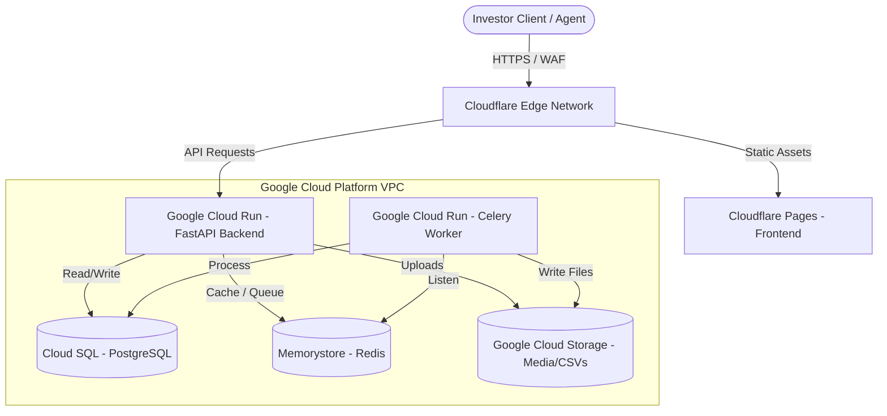

# Architectural Migration Blueprint: GCP & Cloudflare

This document outlines the ideal cloud architecture for migrating the AuctionOS platform to a highly robust, scalable, and secure production environment. It leverages **Google Cloud Platform (GCP)** for core compute, databases, and queues, combined with **Cloudflare** for edge delivery, security, and static hosting.

---

## 🏗️ The Hybrid Architecture Overview

By combining GCP's powerful serverless and managed database offerings with Cloudflare's global edge network, we achieve a modern, resilient, and cost-effective infrastructure.



---

## 1. Frontend Hosting: Cloudflare Pages

The React/Vite frontend is an SPA (Single Page Application). Hosting it on Cloudflare Pages is the gold standard for performance and cost.

*   **How it works:** Cloudflare builds and deploys your static files directly onto its global edge network.
*   **Key Benefits:**
    *   **Near-Zero Latency:** Pages are cached at the edge (CDN) closest to the investor, loading instantly.
    *   **Unlimited Bandwidth:** Extremely cost-efficient (usually completely free under the standard tier).
    *   **CI/CD Integration:** Automatically deploys new updates directly from Git branches.

---

## 2. Backend & Database: Google Cloud Platform (GCP)

For the Python FastAPI backend, database, and background workers, GCP offers enterprise-grade reliability and automated maintenance.

### A. Compute (FastAPI Backend): Google Cloud Run
*   **What it is:** A fully managed serverless platform that runs standard Docker containers.
*   **Why it's ideal:**
    *   **Scale-to-Zero:** If no users are browsing the site (e.g., at 3:00 AM), it scales down to **zero active instances**, costing you **$0**.
    *   **Instant Scaling:** During peak auction hours, it can scale to dozens of containers in seconds.
    *   **Managed HTTPS:** SSL certificates and domain mappings are fully automated.

### B. Database (PostgreSQL): Google Cloud SQL
*   **What it is:** A fully managed, high-performance relational database service.
*   **Why it's ideal:**
    *   **Zero Ops:** Automatic daily backups, minor engine updates, and storage auto-resizing.
    *   **High Availability (HA):** Single-click failover setup to replicate data in real-time across multiple zones.
    *   **Security:** IAM integration and strict VPC network isolation.

### C. Caching & Queue (Redis): Google Cloud Memorystore
*   **What it is:** A fully managed Redis instance.
*   **Why it's ideal:**
    *   Sub-millisecond latency for FastAPI cache hits.
    *   Handles Celery background queues (CSV imports, ATTOM enrichment) safely without data loss.

### D. File Storage: Google Cloud Storage (GCS)
*   **What it is:** Scalable, durable object storage.
*   **Why it's ideal:**
    *   Perfect for storing uploaded property attachments, CSV raw files, and Field Agent photos.
    *   Includes lifecycle policies (e.g., automatically moving older files to cheaper Archive tiers).

---

## 3. Global Security and Delivery: Cloudflare DNS & WAF

Rather than using GCP's expensive Load Balancers and security products, Cloudflare sits in front of the GCP infrastructure.

*   **DDoS Protection:** Standard unmetered mitigation against malicious traffic.
*   **WAF (Web Application Firewall):** Advanced rule sets to block SQL injection attempts, brute force logins, and bad bots trying to scrape your property lists.
*   **Caching & Optimization:** Compress and optimize images and static assets automatically, saving GCP egress bandwidth costs.

---

## 📈 Migration Strategy Phases

> [!NOTE]
> This phased strategy ensures zero-downtime migration and guarantees database integrity.

```mermaid
gantt
    title AuctionOS Migration Schedule
    dateFormat  YYYY-MM-DD
    section Phase 1
    Setup GCP VPC & Databases       :active, p1, 2026-06-01, 5d
    Dockerize Backend & Cloud Run   :active, p2, after p1, 3d
    section Phase 2
    Data Migration (Cloud SQL)      :after p2, p3, 2d
    DNS Switchover (Cloudflare)     :after p3, p4, 1d
    section Phase 3
    Post-Migration Monitoring       :after p4, p5, 4d
```

1.  **Phase 1: Environment Setup:** Provision GCP resources inside a secure private network (VPC). Dockerize the FastAPI backend and configure environment variables.
2.  **Phase 2: Database Replication:** Perform a schema migration and use standard tools like `pg_dump` or live database synchronization to migrate real estate data safely.
3.  **Phase 3: DNS Cutover:** Configure Cloudflare to route frontend traffic to Pages and backend `/api/` traffic to GCP Cloud Run. Monitor system logs.
